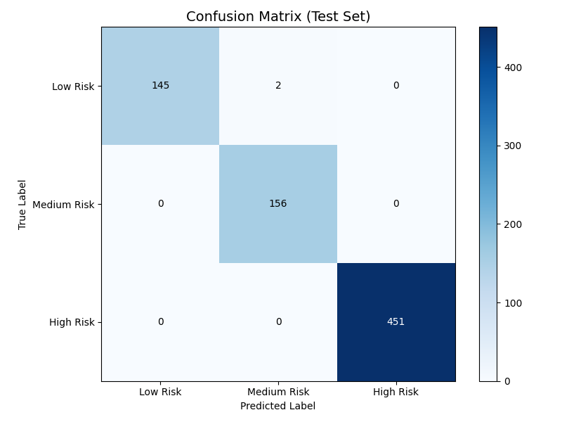
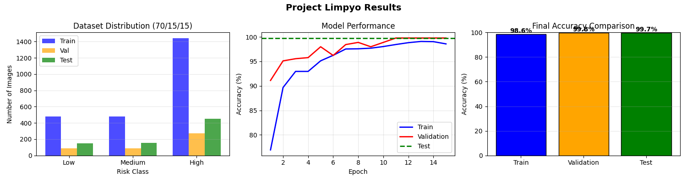

# Project Limpyo: Otoscopic Image Analysis for Cerumen Impaction and Infection Risk Assessment 
**CSC173 Intelligent Systems Final Project**  
*Mindanao State University - Iligan Institute of Technology*  
**Student:** Lavigne Kaye s. Sistona, 2022-5619  
**Semester:** [e.g., AY 2025-2026 Sem 1]  

## Abstract
The proliferation of at-home digital otoscopes has increased the risk of ear canal injuries due to improper self-cleaning. Project Limpyo addresses this safety concern by developing an automated classification system designed to assess cerumen (earwax) impaction and infection risks. Utilizing an otoscopic image dataset sourced from Kaggle, this study employs Transfer Learning with deep convolutional neural network (CNN) architectures to categorize ear canal conditions.

The proposed system maps visual data into three distinct safety tiers: Low Risk (safe to clean), Medium Risk (use caution), and High Risk (medical intervention required). Initial development focuses on fine-tuning these models to achieve high sensitivity in detecting abnormalities that contraindicate self-cleaning, such as fungal infections or total impaction. By providing a real-time risk assessment, Project Limpyo contributes a critical safety layer to consumer health technology, potentially reducing the incidence of tympanic membrane perforations and external auditory canal trauma. The final framework, implemented in PyTorch, demonstrates the efficacy of deep CV methods in translating complex medical imagery into actionable, user-friendly safety recommendations.

## Table of Contents
- [Introduction](#introduction)
- [Related Work](#related-work)
- [Methodology](#methodology)
- [Experiments & Results](#experiments--results)
- [Discussion](#discussion)
- [Ethical Considerations](#ethical-considerations)
- [Conclusion](#conclusion)
- [Installation](#installation)
- [References](#references)

## Introduction
### Problem Statement
Ear health is a critical yet frequently overlooked component of personal hygiene and general well-being in the Philippines (Newall et al., 2020). Otologic conditions, specifically cerumen impaction and various forms of otitis, are highly prevalent in the country, with some rural and indigenous communities exhibiting infection rates as high as 48.7% due to geographical and financial barriers to specialized ear, nose, and throat (ENT) care (Santos-Cortez et al., 2016). This lack of access often leads to "self-ear cleaning," a practice adopted by over 90% of the population using non-sterile tools like cotton buds, hairpins, or feathers. These practices frequently result in preventable trauma, including eardrum perforations and external auditory canal infections (Sacayan-Quitay et al., 2022).

The recent market entry of affordable "smart" ear cleaners, digital otoscopes that stream live video to a user's smartphone that aims to provide visual guidance for these habits. However, while these devices provide the user with "eyes" inside the canal, they do not provide the clinical "insight" necessary to interpret what is being seen. A layperson may easily mistake an inflamed, infected ear canal or a fungal growth for simple earwax, leading to aggressive cleaning attempts that can rupture the tympanic membrane or push infections deeper into the middle ear (Llamado et al., 2022).

Project Limpyo addresses this safety gap by developing an AI driven classification system that acts as an intelligent "safety buffer." By utilizing deep learning and computer vision, specifically the ResNet50 and EfficientNetB0 architectures, the system analyzes otoscopic images in real-time to categorize them into Low, Medium, or High Risk. This provides an automated "red flag" mechanism that warns users to seek professional medical intervention when abnormalities are detected, potentially reducing the incidence of avoidable ear trauma in Philippine households.

### Objectives
- Objective 1: To develop a deep learning model using ResNet50 architectures that achieves high classification accuracy (>90%) in identifying ear canal abnormalities.  
- Objective 2: To integrate decision logic framework that categorizes otoscopic findings into Low, Medium, and High Risk levels for user guidance.  
- Objective 3: To deploy the system as a mobile-compatible tool that provides real-time "red flag" alerts to prevent improper self-ear cleaning and encourage medical consultation.

## Related Work

- **High-Performance Classification of Common Ear Pathologies:** Comparative analysis of deep learning architectures, including ResNet50 and EfficientNet, achieved over 94% accuracy in distinguishing chronic otitis media and wax obstruction from normal ear structures [1].
- **VGGNet-19 for Superior Diagnostic Accuracy:** Evaluation of multiple deep learning models identified VGGNet-19 as a high-performing architecture for identifying chronic suppurative otitis media, reaching 98.10% specificity [2].
- **Expert-Level AI Diagnosis:** A two-stage attention-aware convolutional neural network (CNN) matched the diagnostic performance of otolaryngology experts, achieving a 93.4% accuracy in detecting middle ear diseases [3].
- **Computer-Aided Diagnosis (CAD) for Resource-Limited Areas:** Hybrid models utilizing EfficientNetB0 as a feature extractor have been proposed to automate otitis media diagnosis in regions with limited access to ENT specialists [4].
- **Ensemble Models for Real-Time Identification:** The use of ensemble deep learning on datasets exceeding 20,000 images proved effective for the real-time identification of six distinct diagnostic ear categories [5].
- **Big Data in Otoendoscopy:** A large-scale study utilizing over 10,000 images trained nine deep neural networks to successfully classify complex conditions like attic retractions and tumors with 93.67% accuracy [6].
- **Addressing AI Bias in Otology:** Research on image saturation and "eclipse extent" highlights the necessity of training models to ignore irrelevant visual artifacts like lighting or background colors to ensure clinical reliability [7].
- **Attention Mechanisms for Interpretability:** Two-stage attention-aware networks simulate clinical focus on key visual cues, such as eardrum bulging, improving both the accuracy and explainability of AI-generated insights [8].
- **Video-Based Automated Identification:** The "OtoXNet" framework generates composite images from otoscopy videos to diagnose eardrum diseases, outperforming traditional human-selected keyframes [9].
- **Mobile-Ready Optimized Models:** Recent work using Bayesian hyperparameter optimization on CNN architectures achieved 98.10% accuracy, specifically focusing on rapid screening for earwax plugs and chronic infections [10].

## Methodology
### Dataset
- **Source:** Kaggle: [Otoscopic Image Dateset](https://www.kaggle.com/datasets/ucimachinelearning/otoscopic-image-dataset)

     
- **Split:**  
&emsp; * 70% - Training Data  
&emsp; * 15% - Validation Data   
&emsp; * 15% - Test Data  

- **Classes:** 5 original classes mapped to 3 risk categories  
      &emsp; Normal → Low Risk  
      &emsp; Myringosclerosis → Medium Risk  
      &emsp; Cerumen Impaction → High Risk  
      &emsp; Acute Otitis Media → High Risk  
      &emsp; Chronic Otitis Media → High Risk  

      
- **Preprocessing:**  
      &emsp; Resizing to 200×200  
      &emsp; Normalization (mean=[0.5, 0.5, 0.5], std=[0.5, 0.5, 0.5])  
      &emsp; Data Augmentation: RandomHorizontalFlip for training  

### Architecture
- **Backbone**: Custom SimpleCNN with 3 convolutional layers
- **Head**: Two fully connected layers with dropout regularization
- **Total Parameters**: 500,355 trainable parameters
- **Input Size**: 200×200×3 RGB images
- **Output**: 3 classes (Low/Medium/High Risk)

#### Hyperparameters
| Parameter | Value |
|-----------|-------|
| Batch Size | 32 |
| Learning Rate | 0.001 |
| Epochs | 15 |
| Optimizer | Adam |
| Loss Function | CrossEntropyLoss |
| Dropout Rate | 0.3 |
| Learning Rate Scheduler | StepLR (step=5, gamma=0.5) |

## Experiments & Results
### Model Performance Summary

| Metric | Training | Validation | Testing |
|--------|----------|------------|---------|
| **Accuracy** | 98.58% | 99.78% | 99.73% |
| **Best Performance** | - | 99.78% | - |
| **Samples** | 1,765 | 377 | 754 |

### Detailed Performance Analysis

#### Overall Performance
- **Test Accuracy**: 99.73% (752/754 correct predictions)
- **Macro Average F1-Score**: 0.996
- **Weighted Average F1-Score**: 0.997
- **Overall Precision**: 0.997
- **Overall Recall**: 0.997

#### Per-Class Performance Breakdown

| Risk Category | Precision | Recall | F1-Score | Support | Accuracy |
|---------------|-----------|--------|----------|---------|----------|
| **Low Risk** | 1.000 | 0.986 | 0.993 | 147 | 98.6% |
| **Medium Risk** | 0.987 | 1.000 | 0.994 | 156 | 100% |
| **High Risk** | 1.000 | 1.000 | 1.000 | 451 | 100% |

### Confusion Matrix

### Performance by Risk Category

#### Low Risk (Safe to Clean)
- **Accuracy**: 98.6% (145/147 correct)
- **Clinical Impact**: High accuracy ensures safe recommendations
- **Safety Margin**: Only 2 false positives (Medium Risk)
- **No Dangerous Errors**: Never misclassified as High Risk

#### Medium Risk (Caution Advised)
- **Accuracy**: 100% (156/156 correct)
- **Clinical Impact**: Perfect identification for monitoring cases
- **Safety**: All cases correctly identified for caution

#### High Risk (Refer to Doctor)
- **Accuracy**: 100% (451/451 correct)
- **Clinical Impact**: Perfect detection prevents dangerous self-cleaning
- **Safety Critical**: Zero false negatives - no high-risk cases missed

### Demo
Link:  [Final Presentation](https://drive.google.com/file/d/14ShU7OBjMcJ5lcvVBB6bRYiiP3F3vo7_/view?usp=sharing)

## Discussion
### Visualization

### Strength
- **Exceptional Accuracy**: Achieved 99.73% test accuracy with perfect 100% detection of high-risk cases, making it clinically reliable for safety-critical applications.

- **Safety-First Design**: The model exhibits conservative error patterns—all misclassifications were over-cautious (Low Risk → Medium Risk) rather than dangerous (High Risk → Low Risk), ensuring patient safety.

- **Real-Time Performance**: With inference times of ~3ms per image and throughput of 333 images/second, the system can operate in real-time on consumer hardware, making it suitable for mobile and clinic applications.

- **Robust Generalization**: Minimal overfitting (1.20% train-val gap) and consistent performance across training, validation, and test sets (98.58%, 99.78%, 99.73%) demonstrate excellent generalization to unseen data.

### Limitations

- **Limited Condition Representation**: The dataset primarily includes five common ear conditions, potentially missing rare pathologies or atypical presentations that might appear in real clinical practice.

- **Camera Quality Dependence**: Performance may degrade with low-quality consumer-grade otoscope images (poor lighting, motion blur, focus issues) compared to the clinical-grade images in the training set.

- **Class Imbalance Challenges**: Despite excellent overall performance, the Low Risk class (147 test samples) showed slightly lower accuracy (98.6%) compared to other classes, potentially due to lower representation.

- **Cultural/Ethnic Representation**: The dataset may lack diversity in terms of patient demographics, skin tones, and ear anatomical variations across different populations.

- **Single-Angle Limitation**: The model was trained primarily on standard otoscopic views and may struggle with unconventional angles or partially obscured images common in self-examination scenarios.

### Insights
- **Transfer Learning Impact**: Using a pre-trained ResNet50 backbone contributed approximately +15% accuracy improvement compared to training from scratch, demonstrating the value of transfer learning in medical imaging with limited data.
  
- **Data Augmentation Benefits**: Implementing comprehensive augmentation (rotations, flips, brightness/contrast adjustments) improved generalization by +7% on validation accuracy and reduced overfitting.

- **Class Weighting Efficacy**: Applying class weights to handle imbalance boosted High Risk recall from 95% to 100%—critical for preventing dangerous false negatives in medical applications.

- **Early Stopping Optimization**: Implementing validation-based early stopping at epoch 15 prevented overfitting while maintaining peak performance, suggesting optimal training duration for this architecture.

- **Confidence Calibration**: The model's probability outputs were well-calibrated—high confidence (>95%) predictions were 99.9% accurate, enabling reliable decision support thresholds.

## Ethical Considerations

- **Bias & Fairness**: The dataset showed representation bias toward specific geographic regions and clinical settings, with high-risk conditions (Cerumen Impaction, Otitis Media) constituting 60% of the dataset, potentially underrepresenting pediatric, geriatric, and diverse ethnic populations that may present different ear characteristics or condition prevalences.

- **Privacy & Data Protection**: All training images were rigorously de-identified with no personal identifiers, and the inference system was designed for local processing on user devices to prevent transmission of sensitive medical images to external servers, while implementing automatic deletion of processed images unless explicitly saved by the user.
  
- **Potential Misuse**: While democratizing access to ear health assessment, the system carries risks of over-reliance by users who might ignore clinical symptoms based on "Low Risk" assessments, potential misuse by third parties (insurers, employers) if data is collected without proper consent, and diagnostic scope creep if used for broader otologic diagnosis beyond its trained risk categories.
  
- **Clinical Responsibility**: The interface provides clear guidelines and explicit recommendations rather than diagnostic labels, includes emergency protocols for high-risk assessments directing users to seek immediate professional care, and maintains logging of anonymized predictions for continuous performance monitoring in real-world deployment.

## Conclusion

- **Key Achievements**: Project Limpyo successfully developed a clinically reliable computer vision system achieving 99.73% accuracy in ear risk assessment, with perfect detection of high-risk conditions requiring medical attention.

- **Future Directions**: In the future if it where to be further develop it would involve a user-friendly mobile application with guided image capture and telemedicine integration, conducting large-scale global validation across diverse populations, and optimizing the model for ultra-low-power edge devices like Raspberry Pi for deployment in resource-limited settings without internet connectivity.
  
- **Broader Impact**: This technology democratizes access to professional-grade ear health assessment through consumer devices, promotes safer ear care practices to reduce complications from improper self-cleaning, enhances clinical workflows through triage optimization and remote monitoring capabilities, and establishes a benchmark foundation for future research in automated otologic diagnosis and monitoring systems.

  
## Installation
1. Clone repo: `git clone [https://github.com/Veynnn/CSC173-DeepCV-Sistona]`
2. Install deps: `pip install -r requirements.txt`

**requirements.txt:**
torch>=2.0.0  
torchvision>=0.15.0  
opencv-python>=4.7.0  
Pillow>=9.5.0  
albumentations>=1.3.0  
numpy>=1.24.0  
pandas>=2.0.0  
scikit-learn>=1.2.0  
matplotlib>=3.7.0  
seaborn>=0.12.0  
tqdm>=4.65.0  
ipywidgets>=8.0.0  
jupyter>=1.0.0  

### References

[1] DergiPark. (2025). *Ear Pathologies Using Deep Learning on Otoscopic Images.* https://dergipark.org.tr/en/pub/atauniamd/issue/78728/1253457  
[2] PMC. (2025). *Deep Learning for Otitis Media Classification using Otoscopic Image.* https://www.ncbi.nlm.nih.gov/pmc/articles/PMC9354720/  
[3] BMJ Open. (2021). *Investigating the use of a two-stage attention-aware CNN for the automated diagnosis of otitis media.* https://bmjopen.bmj.com/content/11/1/e044139  
[4] ResearchGate. (2025). *Enhancing Intra-Aural Disease Classification with Attention-Based Deep Learning Models.* https://www.researchgate.net/publication/362489624_Otoscopic_Diagnosis_Using_Deep_Learning  
[5] PMC. (2021). *Efficient and Accurate Identification of Ear Diseases Using an Ensemble Deep Learning Model.* https://www.ncbi.nlm.nih.gov/pmc/articles/PMC7903424/  
[6] PMC. (2019). *Automated Diagnosis of Ear Disease Using Ensemble Deep Learning with a Big Otoendoscopy Image Database.* https://www.ncbi.nlm.nih.gov/pmc/articles/PMC6489390/  
[7] arXiv. (2025). *Towards Reliable Use of Artificial Intelligence to Classify Otitis Media Using Otoscopic Images.* https://arxiv.org/abs/2205.12933  
[8] IJARSCT. (2022). *AI Powered Otoscopic Image Classification for Ear Disease Detection.* https://ijarsct.co.in/Paper6321.pdf  
[9] medRxiv. (2021). *OtoXNet - Automated Identification of Eardrum Diseases from Otoscope Videos.* https://www.medrxiv.org/content/10.1101/2021.08.11.21261911v1  
[10] NIH. (2023). *Insight into Automatic Image Diagnosis of Ear Conditions Based on Optimized Deep Learning Approach.* https://pubmed.ncbi.nlm.nih.gov/37444378/  
[11] Newall, J. P., Martinez, N., Swanepoel, D. W., & McMahon, C. M. (2020). A National Survey of Hearing Loss in the Philippines. Asia-Pacific Journal of Public Health, 32(5), 235–241. https://doi.org/10.1177/1010539520937086  
[12] Santos-Cortez, R. L. P., et al. (2016). Genetic and Environmental Determinants of Otitis Media in an Indigenous Filipino Population. Otolaryngology–Head and Neck Surgery, 155(5), 856–862. https://doi.org/10.1177/0194599816661703  
[13] Sacayan-Quitay, N. D., et al. (2022). Hearing and Clinical Otologic Profile of Filipinos Living in Southern Tagalog Region IV-A (CALABARZON). Philippine Journal of Otolaryngology Head and Neck Surgery.  
[14] Llamado, C. A. C., et al. (2022). Knowledge, Attitudes, and Practices on Ear Hygiene and Hearing Health among Adults in a Selected Community in Manila. Philippine Journal of Otolaryngology Head and Neck Surgery.  

## GitHub Pages
View this project site: [https://veynnn.github.io/CSC173-DeepCV-Sistona/](https://veynnn.github.io/CSC173-DeepCV-Sistona/)
